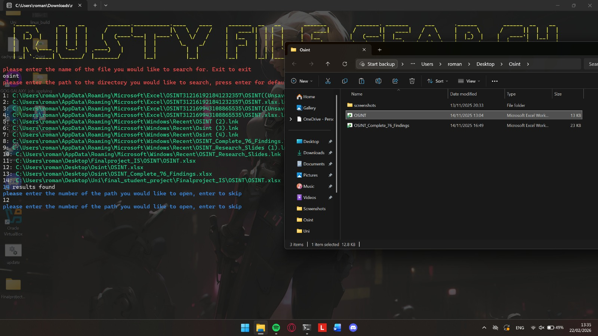
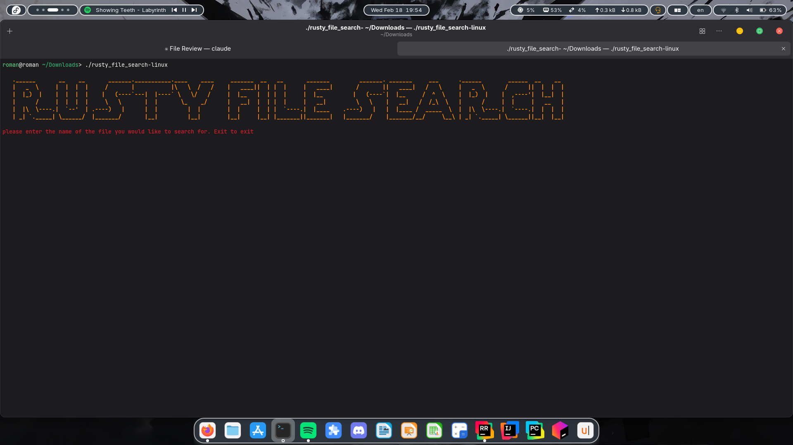
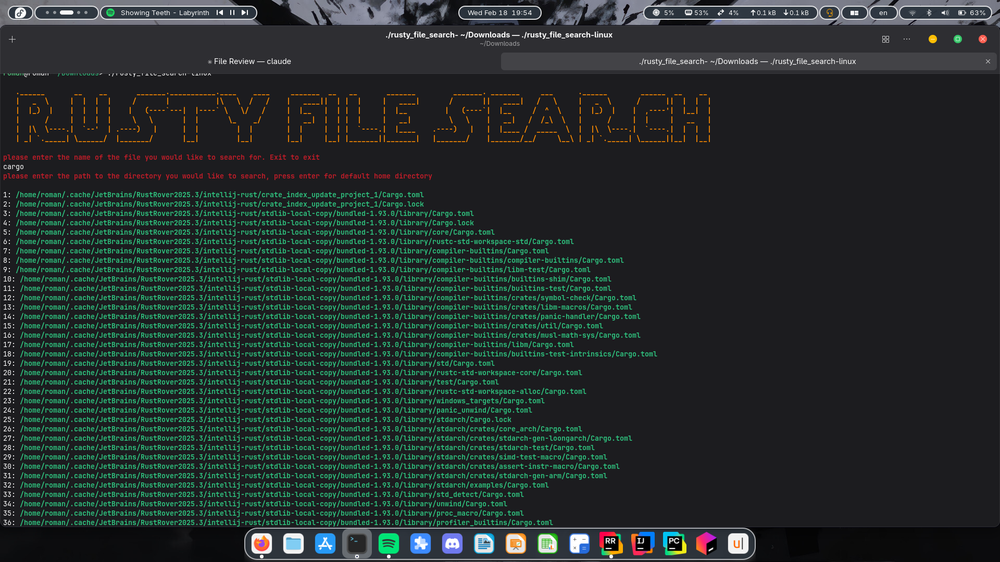
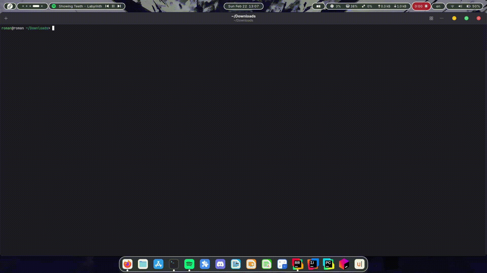

# Rusty File Search

A fast, multithreaded file search tool built from scratch in Rust. 

<!-- Screenshot of the tool in action -->
<!--  -->

## What It Does

Rusty File Search takes a filename (or part of one), scans through your directories using multiple threads, and shows you where your files are. That's it. No indexing databases, no content scanning, no waiting around.

**Features:**

- **Multithreaded search** — splits work across all your CPU cores using standard library threading primitives (no external concurrency frameworks)
- **Smart matching** — case-insensitive, partial filename matching. Searching `note` finds `Notes.txt`, `my_notebook.pdf`, and `NOTES_2024.docx`
- **Opens the containing folder** — select any result and it opens the folder in your file manager with the file highlighted, on all platforms
- **Cross-platform** — works on Linux, macOS, and Windows
- **Unicode support** — handles Hebrew, Arabic, Chinese, emoji filenames — anything UTF-8
- **Simple TUI** — colorful terminal interface anyone can use, no command-line flags to memorize
- **Zero configuration** — no setup, no indexing, no config files. Just run it.

## Screenshots

<!-- Add your screenshots here. Suggested screenshots: -->

 

<!-- 2. A search in action with results 
 -->

<!-- 3. No results found -->
  
 

## Installation

### Download a Binary

Grab the latest release for your platform from the [Releases page](../../releases):

- `rusty_file_search-linux` — Linux
- `rusty_file_search-macos` — macOS
- `rusty_file_search-windows.exe` — Windows

Make it executable (Linux/macOS):
```bash
chmod +x rusty_file_search-linux
./rusty_file_search-linux
```

On Windows, just double-click the `.exe` or run it from a terminal.

### Build From Source

Requires [Rust](https://rustup.rs/) (1.85+ for the 2024 edition).

```bash
git clone https://github.com/roman11x/rusty_file_search.git
cd rusty_file_search
cargo build --release
```

The binary will be at `target/release/rusty_file_search`.

## Usage

Just run it and follow the prompts:

```
$ ./rusty_file_search
```

<!--  -->

1. Enter the filename (or part of it) you're looking for
2. Enter the directory to search (press Enter for your home directory)
3. See your results
4. Search again or type `exit` to quit

## How It Works

Rusty File Search uses a two-phase approach:

1. **Walk** — traverses the directory tree and collects all directories
2. **Search** — distributes the directories across worker threads (one per CPU core), each thread scans its assigned directories for matching filenames

When you select a result, it opens the containing folder in your system's file manager with the file highlighted — using explorer /select on Windows, open -R on macOS, and xdg-open on Linux.

All threading is implemented using Rust's standard library (`std::thread`, `std::sync::Arc`) without external concurrency crates like `rayon`. The number of threads automatically matches your CPU's available parallelism.

## Performance

Rusty File Search goes directly to the filesystem instead of relying on a pre-built index. This makes it competitive with (and often faster than) built-in OS search tools, especially in cases where:

- The OS search index is outdated or incomplete
- You're searching directories that aren't indexed
- You just need filename matching, not content search

<!-- If you have benchmark numbers, add them here -->
<!-- | Tool | Time to search home directory | -->
<!-- |------|-----------------------------| -->
<!-- | Rusty File Search | X.Xs | -->
<!-- | Windows Search | X.Xs | -->

## Built With

- **Rust** (2024 edition) — chosen for speed, safety, and compile-time guarantees
- **colored** — terminal colors
- **std::thread** — multithreading with no external concurrency frameworks

## License

This project is open source. Feel free to use it, modify it, and share it.

---

